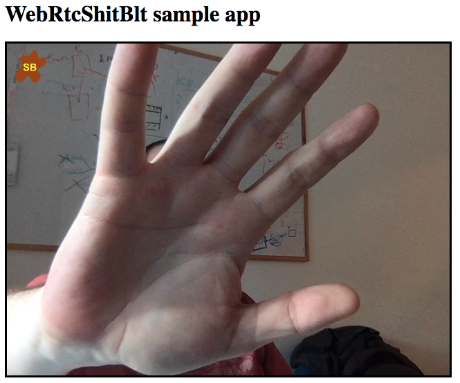

# WebRtcShitBlt

[](https://www.npmjs.com/package/webrtcshitblt)
#### Live demo at https://asafrob.github.io/WebRtcShitBlt/

image show a smaple use of a video captured by WebRTC with an embeded image (brown/yellow) on the top left corner<br/>


### what does it do ?
This library wraps a WebRTC source and returns a MediaStream that can be used as a normal MediaStream u get from navigator.mediaDevices.getUserMedia.<br/>
The returned MediaStream will have your selected image embeded in the video stream.

### common usecases
* logo
* watermark
* image extracted from a presentation

### how does it work
The code creates an hidden video element and an hidden canvas element<br/>
The original MediaStream is played on the hidden video element.<br/>
The video element is sampled for images, which are drawn to the hidden canvas.<br/>
The logo image is also being drawn to the canvas.<br/>
Canvas MediaStream is returned to the calling app.

### Sample code
```javascript
        // the constanint object defaults to {video: true, audio: true} but to save u the echo...
        var sb = new WebRtcSB({video:{width:640, height:480}, audio: false});
        // create manipulation objects. they will be processed in the order you supply them.
        // in current live demo u will get 4 images
        var imgCopy = new ImageCopy();
        var imgAdd = new ImageAdd('sb.png', 10, 10, 50, 50);
        sb.setManipulators([imgCopy, imgAdd]);

        sb.sbStartCapture()
            .then((stream)=>{
            document.getElementById('myVideo').srcObject = stream;
        })
```

### Note
* this library is based on ES6

### Tested on
* chrome 63 (OS X)
* FireFox 57 (OS X)
* Safari 11.0.3 (OS X)

### Roadmap
* test & support other browsers/OSs
* implement more plugins

### Versions history
####1.0.0
initial release
####1.0.1
workaround for safari -  instead of an hidden video element use a 1px*1px video element
####1.0.2
support iOS 11